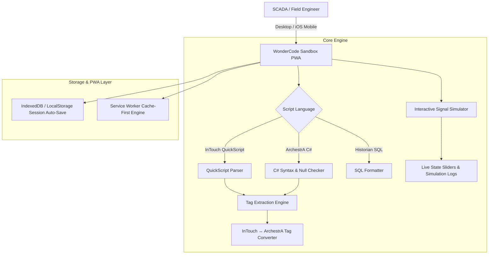

```

# WonderCode Sandbox ⚡

> **Industrial SCADA Code Editor & Offline PWA** | Tailored for AVEVA™ System Platform, InTouch QuickScript, ArchestrA C#, and Historian SQL workflows. Optimized for field deployment at **Al Gurg Automation & Controls LLC (AGAC)**.

[](https://esp046-cyber.github.io/WonderCode-Sandbox/)
[](https://esp046-cyber.github.io/WonderCode-Sandbox/)
[](https://esp046-cyber.github.io/WonderCode-Sandbox/)
[](LICENSE)
```

---

## 🛠️ Overview & Purpose

**WonderCode Sandbox** is a lightweight, zero-dependency, browser-native IDE designed specifically for SCADA and Control Systems Engineers working with AVEVA / Wonderware ecosystems. It allows engineers to draft, convert, validate, and simulate SCADA scripts directly on control room workstations or field mobile devices (iPhones/iPads) without requiring full IDE installation.

---

## 🚀 Key Features

* **Multi-Tab Industrial Editor:** Work on multiple script files simultaneously with dedicated syntax highlighting for InTouch QuickScript, ArchestrA C# object scripts, and Historian SQL.
* **SCADA Syntax Validator:** Detects unhandled null references, infinite loops, invalid tag characters, and missing `SHOWWINDOW` or `ENDIF` statements before deployment to Galaxy Repositories.
* **Bi-Directional Tag Converter:** Instantly convert tag references between InTouch Tag Dictionary syntax (`TK_101_LIT.PV`) and System Platform ArchestrA attribute references (`Me.TK_101_LIT.PV`).
* **Interactive Tag Simulator:** Parse extracted tags into dynamic sliders and switches to simulate analog/digital signal state changes with execution logs.
* **100% Offline PWA Capabilities:** Operates seamlessly without internet connection using Service Worker cache-first strategies and IndexedDB session persistence.
* **iOS / Mobile Safari Responsive UI:** Built with dynamic viewport handling (`100dvh`), notch safe-area insets (`env(safe-area-inset-top)`), and touch targets >= 44px.

---

## 🏗️ System Architecture & Workflow



---

## 🏭 AGAC Domain Template Library

Pre-loaded with industrial application templates aligned with **Al Gurg Automation & Controls LLC** project verticals:

| Domain | Application Template | Associated Tags & Functions |
| --- | --- | --- |
| **District Cooling** | TES Charging/Discharging Valve Sequencer, DP Lead/Lag Pump Ramping, Plant COP Staging | `Me.Chiller_01.KW`, `Me.TES_Tank_Temp`, `Me.Secondary_DP.PV` |
| **Oil & Gas** | Tank Farm High-High ESD Interlock, Volumetric Strapping Calculation, Pipeline Flow Accumulator | `Me.TK_101_LIT.PV`, `Me.TK_101_HH_SP`, `Me.XV_101_Close` |
| **Water & Wastewater** | Duty/Standby Pump Rotation Timer, Chemical Dosing PID Loop, Wet Well Level Sequencer | `Me.Pump_01.RunHours`, `Me.Dosing_PPM.SP`, `Me.WetWell_LIT.PV` |
| **Metals & Minerals** | Conveyor Belt Zero-Speed Interlock, Crusher Lube Oil Fault Trip, Slurry Pump Flush Sequence | `Me.Belt_SS_01.Speed`, `Me.Lube_Temp.PV`, `Me.Flush_Valve.Cmd` |
| **Food & Beverage** | CIP 5-Phase Sanitization Timer, HTST Pasteurizer Divert Safety Interlock, Batching Load-Cell Tare | `Me.CIP_State`, `Me.Pasteurizer_Temp.PV`, `Me.Dose_Weight.PV` |

---

## 📱 iPhone / Mobile PWA Installation

To run **WonderCode Sandbox** as a standalone app on iOS:

1. Open **[esp046-cyber.github.io/WonderCode-Sandbox/](https://esp046-cyber.github.io/WonderCode-Sandbox/)** in Safari.
2. Tap the **Share** icon (bottom toolbar).
3. Scroll down and select **Add to Home Screen**.
4. Launch **WonderCode** from your home screen for full-screen offline access.

---

## 📂 Repository Structure

```text
WonderCode-Sandbox/
├── index.html                  # Main Web Application Shell
├── offline.html                # Offline Fallback Page
├── 404.html                    # SPA Fallback Page
├── style.css                   # Responsive Mobile & Safe-Area Styles
├── app.js                      # Core Application Initialization
├── service-worker.js           # PWA Offline Cache Management
├── sw-register.js              # Service Worker Lifecycle Handler
├── manifest.webmanifest        # PWA Metadata & iOS Launch Config
├── js/
│   ├── db.js                   # IndexedDB Persistence Manager
│   ├── editor.js               # Multi-Tab Editor & Layout Handler
│   ├── tag-converter.js        # Tag Extraction & Translation Engine
│   ├── templates.js            # Industrial Domain Code Templates
│   └── validator.js            # SCADA Syntax & Logic Validator
├── icons/                      # PWA Icon Sets & Favicons
├── docs/                       # Architecture & Technical Docs
└── .github/workflows/deploy.yml # GitHub Pages CI/CD Workflow

```

---

## 💻 Local Development

Run the application locally using any standard static file server:

### Option 1: Python HTTP Server

```bash
python3 -m http.server 8080

```

### Option 2: Node.js / NPM

```bash
npm start

```

Navigate to `http://localhost:8080` in your web browser.

---

## 🚢 Deployment Workflow

The repository includes a GitHub Actions workflow (`.github/workflows/deploy.yml`) configured to deploy directly to GitHub Pages on every push to the `main` branch:

```bash
git add .
git commit -m "Update application features"
git push origin main

```

Live URL: **[https://esp046-cyber.github.io/WonderCode-Sandbox/](https://esp046-cyber.github.io/WonderCode-Sandbox/)**

---

## 📄 License

Distributed under the MIT License. See `LICENSE` for details.

```

```
